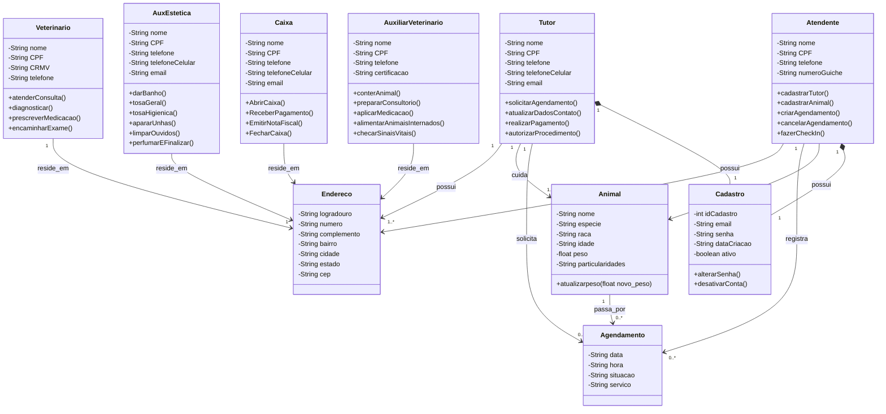

# trabalho-engenharia-software-2026

### Diagrama de Classes

```mermaid
classDiagram
    class Tutor {
        -String nome
        -String CPF
        -String telefone
        -String telefoneCelular
        -String email
        +solicitarAgendamento()
        +atualizarDadosContato()
        +realizarPagamento()
        +autorizarProcedimento()
    }
    
    class Endereco {
        -String logradouro
        -String numero
        -String complemento
        -String bairro
        -String cidade
        -String estado
        -String cep
    }
    
    class Animal {
        -String nome
        -String especie
        -String raca
        -String idade
        -float peso
        -String particularidades
        +atualizarpeso(float novo_peso)
    }

    class Veterinario {
        -String nome
        -String CPF
        -String CRMV
        -String telefone
        +atenderConsulta()
        +diagnosticar()
        +prescreverMedicacao()
        +encaminharExame()
    }
  
    class AuxEstetica {
        -String nome
        -String CPF
        -String telefone
        -String telefoneCelular
        -String email
        +darBanho()
        +tosaGeral()
        +tosaHigienica()
        +apararUnhas()
        +limparOuvidos()
        +perfumarEFinalizar()
    }

    class Caixa {
        -String nome
        -String CPF
        -String telefone
        -String telefoneCelular
        -String email
        +AbrirCaixa()
        +ReceberPagamento()
        +EmitirNotaFiscal()
        +FecharCaixa()
    }
    
    class AuxiliarVeterinario {
        -String nome
        -String CPF
        -String telefone
        -String certificacao
        +conterAnimal()
        +prepararConsultorio()
        +aplicarMedicacao()
        +alimentarAnimaisInternados()
        +checarSinaisVitais()
    }

    class Atendente {
        -String nome
        -String CPF
        -String telefone
        -String numeroGuiche
        +cadastrarTutor()
        +cadastrarAnimal()
        +criarAgendamento()
        +cancelarAgendamento()
        +fazerCheckIn()
    }

    class Agendamento {
        -String data
        -String hora
        -String situacao
        -String servico
    }

    class Cadastro {
        -int idCadastro
        -String email
        -String senha
        -String dataCriacao
        -boolean ativo
        +alterarSenha()
        +desativarConta()
    }
    
    Tutor "1" --> "1..*" Endereco : possui
    Tutor "1" --> "1..*" Animal : cuida
    Veterinario "1" --> "1" Endereco : reside_em
    Atendente --> Endereco : reside_em
    AuxEstetica --> Endereco : reside_em
    Caixa --> Endereco : reside_em
    AuxiliarVeterinario --> Endereco : reside_em
   
    Atendente "1" --> "0..*" Agendamento : registra
    Tutor "1" --> "0..*" Agendamento : solicita
    Animal "1" --> "0..*" Agendamento : passa_por 
    Atendente --> Animal : cadastra 
    Tutor "1" *-- "1" Cadastro : possui
    Atendente "1" *-- "1" Cadastro : possui
```

### Diagrama de Casos de Uso

```mermaid
flowchart LR
    %% Atores da Clinica
    Tutor["Tutor"]
    Veterinario["Veterinário"]
    AuxEstetica["Auxiliar de Estética"]
    Caixa["Caixa"]
    AuxVeterinario["Auxiliar Veterinário"]
    Atendente["Atendente"]

    %% 2. O Sistema com os Casos de Uso
    subgraph sistema [Sistema da Clínica Veterinária]
        %% Ações do Tutor
        solicitar["Solicitar Agendamento"]
        atualizarContato["Atualizar Dados de Contato"]
        pagar["Realizar Pagamento"]
        autorizarProc["Autorizar Procedimento"]

        %% Ações do Veterinário
        atender["Atender Consulta"]
        diagnosticar["Diagnosticar"]
        prescrever["Prescrever Medicação"]
        encaminharExame["Encaminhar Exame"]

        %% Ações do Auxiliar de Estética
        darBanho["Dar Banho"]
        tosarGrooming["Tosar / Grooming"]
        apararUnhas["Aparar Unhas"]
        limparOuvido["Limpar Ouvido"]
        perfumar["Perfumar / Finalizar"]

        %% Ações do Caixa
        abrirCaixa["Abrir Caixa"]
        receberPag["Receber Pagamento"]
        emitirNota["Emitir Nota Fiscal"]
        fecharCaixa["Fechar Caixa"]

        %% Ações do Auxiliar Veterinário
        conter["Conter Animal"]
        prepararConsultorio["Preparar Consultório"]
        aplicarMed["Aplicar Medicação"]
        alimentarInternados["Alimentar Animais Internados"]
        checarSinais["Checar Sinais Vitais"]

        %% Ações da Atendente
        cadastrarTutor["Cadastrar Tutor"]
        cadastrarAnimal["Cadastrar Animal"]
        criarAgendamento["Criar Agendamento"]
        cancelarAgendamento["Cancelar Agendamento"]
        fazerCheckIn["Fazer Check-In"]
    end

    %% 3. Conexões de Associação
    Tutor --- solicitar
    Tutor --- atualizarContato
    Tutor --- pagar
    Tutor --- autorizarProced

    Veterinario --- atender
    Veterinario --- diagnosticar
    Veterinario --- prescrever
    Veterinario --- encaminharExame

    AuxEstetica --- darBanho
    AuxEstetica --- tosarGrooming
    AuxEstetica --- apararUnhas
    AuxEstetica --- limparOuvido
    AuxEstetica --- perfumar

    Caixa --- abrirCaixa
    Caixa --- receberPag
    Caixa --- emitirNota
    Caixa --- fecharCaixa

    AuxVeterinario --- conter
    AuxVeterinario --- prepararConsultorio
    AuxVeterinario --- aplicarMed
    AuxVeterinario --- alimentarInternados
    AuxVeterinario --- checarSinais

    Atendente --- cadastrarTutor
    Atendente --- cadastrarAnimal
    Atendente --- criarAgendamento
    Atendente --- cancelarAgendamento
    Atendente --- fazerCheckIn
```

